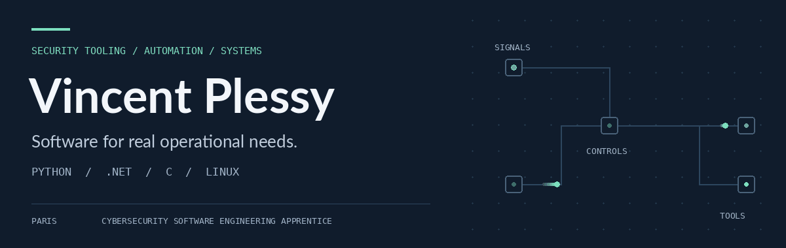

<picture>
  <source media="(prefers-reduced-motion: reduce)" srcset="assets/profile-header.png">
  
</picture>

  <a href="https://www.linkedin.com/in/vincent-plessy-99852a36b">LinkedIn</a> &nbsp;·&nbsp;
  <a href="https://vincent-p-essy.github.io/">Portfolio</a> &nbsp;·&nbsp;
  <a href="https://medium.com/@vincent.plessy12">Writing</a> &nbsp;·&nbsp;
  <a href="mailto:vincent.plessy12@gmail.com">Email</a>

### Security tooling. Automation. Systems.

I build tools that turn operational needs into usable software: security applications, workflow automation and offline web applications.

**Cybersecurity engineering apprentice at Société Générale since October 2026**, focused on security tooling and automation, alongside my MSc at Epitech Paris. Previously, I developed internal applications and reporting tools during my apprenticeship at SNCF Voyageurs.

My technical interests connect **security tooling, automation and systems**, with hands-on projects in Python, C#/.NET, C and Linux.

---

## Experience

**Société Générale · Cybersecurity engineering apprenticeship — tooling & automation**

Internal security applications, cybersecurity process automation, cyber-risk dashboards and technical documentation, within the Information Security & Risks and Group CyberSec Tooling teams.

**SNCF Voyageurs · Web application development & automation apprenticeship**

Internal web applications and offline PWAs for operational teams, alongside Power BI reporting and Excel/VBA automation. One example is **Scénar’Express**, an offline decision-support application for railway incidents, with an interactive map, local search and PDF procedures.

**Apex 3D · Co-founder & frontend developer**

Designed and developed a responsive product-catalogue website in HTML, CSS and JavaScript, deployed with GitHub Pages.

## Engineering focus

| Security tooling | Operational automation | Systems foundations |
| :--- | :--- | :--- |
| Audit trails, incident workflows, authentication and detection rules | Reusable security checks, reporting and offline decision-support tools | C, memory management, network parsing and Linux |

## Selected technical projects

Personal projects and technical demonstrations, distinct from my work at Société Générale and SNCF.

| Project | What it explores | Technologies |
| :--- | :--- | :--- |
| [Security Audit Logger](https://github.com/Vincent-P-essy/Security-Audit-Logger) | Request audit trails, anomaly rules and role-based API access | C# · .NET 8 · SQL Server · Docker |
| [Incident Tracker API](https://github.com/Vincent-P-essy/incident-tracker-api) | Security-incident workflows, JWT authentication and role-based permissions | Python · Flask · PostgreSQL |
| [pcap-analyzer](https://github.com/Vincent-P-essy/pcap-analyzer) | Network-capture parsing, attack-pattern heuristics and structured JSON reports | C · libpcap |
| [ci-security-gate](https://github.com/Vincent-P-essy/ci-security-gate) | Reusable checks for secrets, dependencies and Dockerfiles | GitHub Actions · Python · Docker |
| [dora-compliance-engine](https://github.com/Vincent-P-essy/dora-compliance-engine) | A prototype for collecting audit evidence and evaluating a limited set of compliance controls | Python · OPA/Rego · PostgreSQL |
| [Memory allocator](https://github.com/Vincent-P-essy/mini-projet-allocateur-de-m-moire) | Manual memory management and linked memory blocks | C |

## Technical foundations

| Area | Tools & languages |
| :--- | :--- |
| Backend | Python · Flask · C#/.NET · SQL · PostgreSQL |
| Systems & networks | C · Linux · Bash · Wireshark |
| Development & delivery | Git · Docker · GitHub Actions · automated tests |
| Operational applications | JavaScript · HTML/CSS · PWAs · Power BI · Excel/VBA |
| Other programming experience | Java · TypeScript |

**Certifications:** Microsoft SC-900 · Google Cybersecurity Professional Certificate · Fortinet Certified Fundamentals in Cybersecurity.

<strong>More projects — games & interactive applications</strong>

- [BackPack Hero](https://github.com/Vincent-P-essy/BackPackHero) — turn-based combat, inventory and equipment in Java.
- [Minecraft Clone](https://github.com/Vincent-P-essy/minecraft-clone) — procedural voxel terrain and block interaction with TypeScript and WebGL.
- [CyberPass](https://github.com/Vincent-P-essy/CyberPass) — a security-evidence application with a Next.js frontend and FastAPI backend.
- [Kernel Sentinel](https://github.com/Vincent-P-essy/kernel-sentinel) — security-detection experiments with Go and eBPF.

## Contributions

<picture>
  <source media="(prefers-color-scheme: dark)" srcset="https://raw.githubusercontent.com/Vincent-P-essy/Vincent-P-essy/output/github-contribution-grid-snake-dark.svg">
  
</picture>

---

**Paris, France** · Open to short freelance assignments compatible with my apprenticeship: scoped security reviews, automation and backend development.
